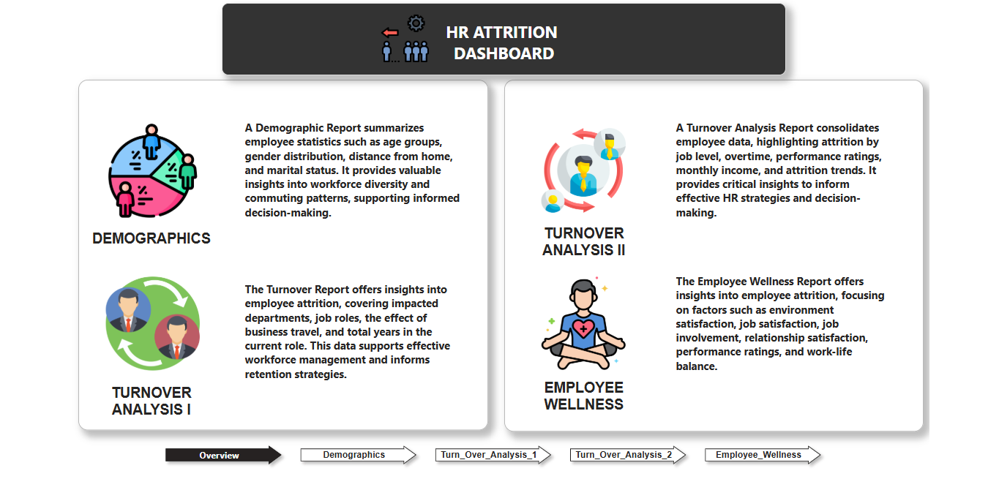
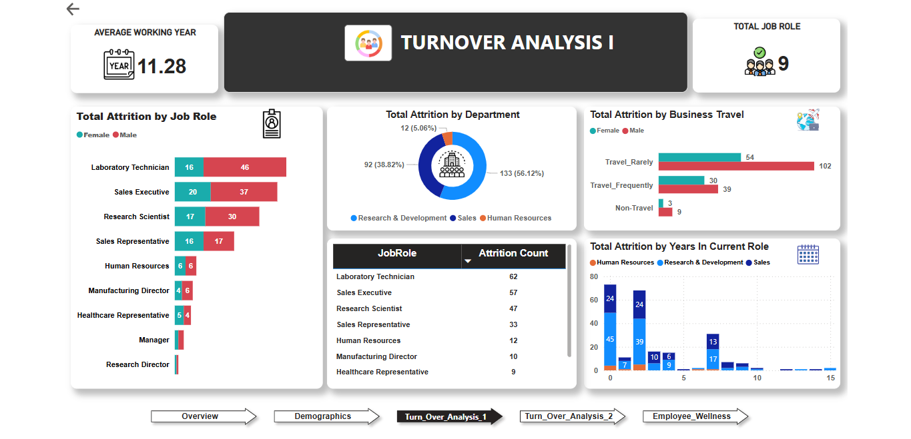
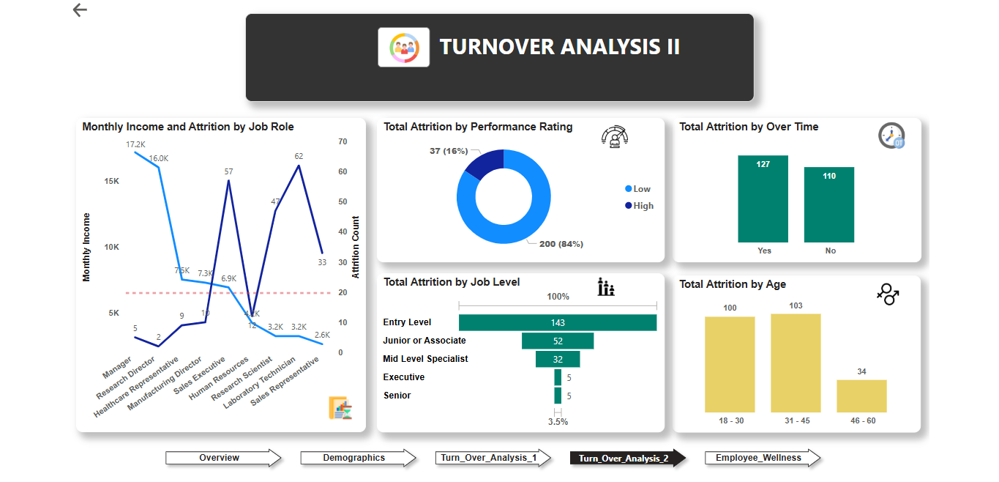
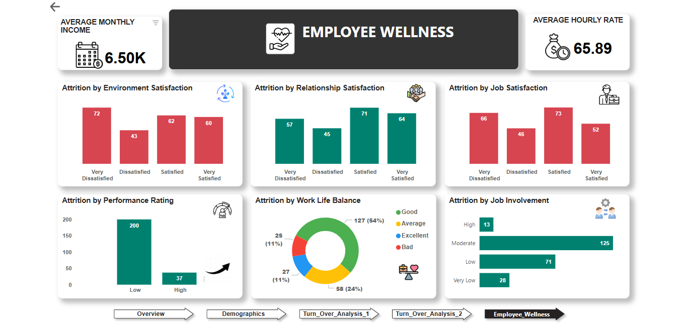

# HR Attrition Dashboard

## Overview

The HR Attrition Dashboard is an interactive tool developed in **Power BI** to analyze and visualize workforce data. It empowers HR professionals and management teams to uncover patterns, monitor trends, and design actionable strategies to reduce employee attrition.

This dashboard provides insights into key metrics such as attrition rates, department-wise turnover, job role-specific trends, and demographic analysis, facilitating informed decision-making and improved workforce retention.

---

## Dataset Overview

The dataset consists of **1,470 employee records** with **38 attributes** across the following categories:
- **Attrition**: Departure indicators.
- **Demographics**: Age, gender, marital status, education, and job roles.
- **Work Metrics**: Income levels, years at the company, travel frequency.
- **Feedback Metrics**: Job satisfaction, work-life balance, and performance ratings.

---

## Tools Used

- **Power BI**: For creating dynamic and interactive dashboards.
- **Excel**: For flexible data manipulation, analysis, and reporting.

---

## Features

### 1. **Key Metrics and Visualizations**
- **Attrition Rate**: Overall percentage of employees leaving the organization.
- **Attrition by Department**: Identification of departments with the highest turnover.
- **Attrition by Job Role**: Highlighting roles most impacted by attrition.
- **Demographic Insights**: Age group distribution and gender breakdown.

### 2. **Trends Analysis**
- **Age Trends**: Employees in the 18-30 and 31-45 age groups show higher attrition, often driven by career advancement and work-life balance challenges.
- **Job Roles**: High turnover observed among Laboratory Technicians, indicating the need for targeted interventions.
- **Performance & Satisfaction**: Strong correlation between low job satisfaction/performance and higher attrition rates.

### 3. **Actionable Strategies**
Based on insights from the data:
- **Age Group (25–34 years)**: Implement flexible work policies and career advancement programs.
- **Job Roles (e.g., Laboratory Technicians)**: Provide tailored career development plans, frequent feedback, and recognition.
- **New Employees**: Enhance onboarding processes, mentorship opportunities, and feedback systems.

---

## Usage Instructions

1. Open the Power BI dashboard file (`HR_Dashboard.pbix`).
2. Explore the visualizations and metrics:
   - Navigate through department, job role, and demographic-specific insights.
   - Filter by attributes such as age group, job role, and performance rating to view tailored data.
3. Use insights to inform HR strategies and initiatives for workforce retention.

---

### Dashboard Overview
### **Landing Page**
The landing page provides a high-level overview of the HR Attrition Dashboard and serves as a navigation hub for exploring deeper insights.

### **1. Demographics**
A **Demographic Report** summarizes employee statistics such as:
- **Age Groups** and **Gender Distribution**
- **Distance from Home**
- **Marital Status**

This report provides valuable insights into workforce diversity and commuting patterns, supporting informed decision-making.

### **2. Turnover Analysis I**
The **Turnover Report I** offers insights into employee attrition by highlighting:
- Impacted **departments** and **job roles**
- The effect of **business travel**
- Total **years in the current role**

This data supports effective workforce management and informs retention strategies.

### **3. Turnover Analysis II**
The **Turnover Report II** consolidates employee data and focuses on:
- Attrition by **job level**, **overtime**, and **performance ratings**
- Insights into **monthly income** and **attrition trends**

This report provides critical insights to inform effective HR strategies.

### **4. Employee Wellness**
The **Employee Wellness Report** explores factors influencing employee attrition, including:
- **Environment Satisfaction**
- **Job Satisfaction** and **Job Involvement**
- **Relationship Satisfaction**
- **Performance Ratings**
- **Work-Life Balance**

This report offers key insights to enhance employee wellness and retention.

---

## Live Links

- **Live Presentation**: [View Here]([link_to_presentation](https://www.canva.com/design/DAGYFNLGS88/1yk0aNAEBb9jE3waxAVODA/edit?utm_content=DAGYFNLGS88&utm_campaign=designshare&utm_medium=link2&utm_source=sharebutton))
- **Interactive Dashboard**: [Access the Dashboard]([link_to_dashboard](https://app.powerbi.com/view?r=eyJrIjoiNDk0ZDViZWQtZDgwMi00MzU3LTg5ZGMtMjAwYzUxYTBhZTI3IiwidCI6ImM2ZTU0OWIzLTVmNDUtNDAzMi1hYWU5LWQ0MjQ0ZGM1YjJjNCJ9))

---

## Conclusion

**"Retention isn’t just about reducing attrition; it’s about creating a workplace where employees want to stay and grow."**

With this dashboard, organizations can transition from reactive to proactive HR management, leveraging data to craft informed retention strategies.

---

## Author

Presented by **Karan Bharale**  
For any questions or feedback, please reach out.

